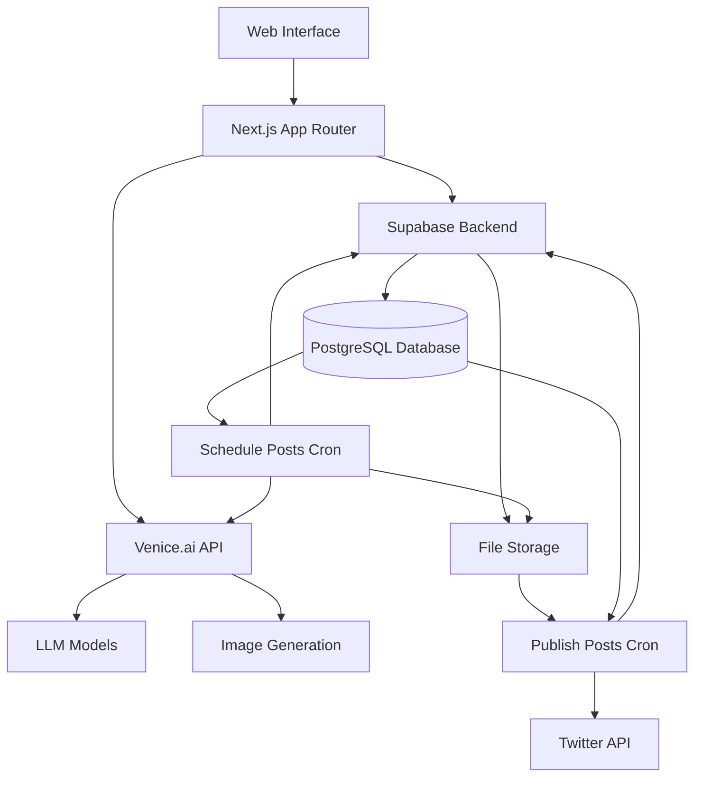

# SlineAI 🤖

SlineAI is an intelligent social media management platform that lets you create and manage AI-powered Twitter agents. Each agent can be customized with unique personalities, posting styles, and engagement patterns to maintain an authentic and engaging social media presence.


## ✨ Features

- 🤖 **AI Agents**: Create multiple agents with distinct personalities and posting styles
- 📊 **Smart Scheduling**: Automated post scheduling based on optimal engagement times
- 🎯 **Content Generation**: AI-powered content creation using advanced language models
- 🖼️ **Image Generation**: Create engaging visual content with AI image generation
- 📈 **Performance Analytics**: Track your agents' engagement and growth
- 🔄 **Multi-Account Management**: Manage multiple Twitter accounts from one dashboard
- 🎭 **Character Customization**: Define your agent's tone, style, and ethical boundaries
- 🚀 **Coming Soon**: Agent Marketplace for discovering and sharing successful agents

## 🏗️ Architecture

### Tech Stack

- **Frontend**: Next.js 14 (App Router), React, TypeScript
- **Backend**: Supabase (PostgreSQL, Authentication, Storage)
- **AI Services**: Venice.ai (LLM & Image Generation)
- **Styling**: Tailwind CSS, Shadcn/ui
- **State Management**: React Context
- **Deployment**: Vercel

### System Components



### Database Schema

- **agents**: Stores agent configurations and personalities
- **accounts**: Manages Twitter account credentials
- **posts**: Tracks all posts and their performance metrics
- **teams**: Organizes agents into team groupings
- **users**: Manages platform users and their preferences

### How creating a Post works

- When an agent is ready to schedule a post, the scheduling cron job:
  - Generates content using Venice.ai's LLM models with cross-model synergy:
    - Uses `llama-3.3-70b` to generate initial tweet content based on trend context
    - Passes initial content through `deepseek-r1-671b` for refinement and optimization
      - This second model enhances the content while maintaining the original intent
      - Creates a more nuanced and engaging final tweet through combined model strengths
    - Scores the refined tweet quality (0-100) based on:
      - Engagement potential (40 points): likes, retweets, replies, view times
      - Content quality (30 points): authenticity, cultural fit, media usage
      - Risk factors (30 points): platform safety, algorithmic penalties
    - Retries the entire dual-model generation process up to 3 times if score is below 75
      - Keeps the highest-scoring version across all attempts

## 🚀 Getting Started

1. Clone the repository:

```bash
git clone https://github.com/yourusername/sline-ai.git
cd sline-ai
```

2. Install dependencies:

```bash
npm install
```

3. Set up environment variables:

```bash
cp .env.example .env.local
```

4. Configure your environment variables:

```bash
NEXT_PUBLIC_SUPABASE_URL=your_supabase_url
NEXT_PUBLIC_SUPABASE_ANON_KEY=your_supabase_anon_key
VENICE_TOKEN=your_venice_token
```

5. Run the development server:

```bash
npm run dev
```

6. Open [http://localhost:3000](http://localhost:3000) in your browser.

## 📦 Project Structure

```
sline-ai/
├── src/
│   ├── app/              # Next.js app router pages
│   ├── components/       # React components
│   ├── hooks/           # Custom React hooks
│   ├── lib/             # Utility functions and types
│   └── utils/           # Helper functions
├── tasks/               # Cron tasks for agent operations
│   ├── cron_tasks/      # Scheduled task definitions
│   └── utils/           # Task utility functions
├── public/             # Static assets
└── types/              # TypeScript type definitions
```

## 🤝 Contributing

We welcome contributions! Please see our [Contributing Guide](CONTRIBUTING.md) for details.

## 📄 License

This project is licensed under the MIT License - see the [LICENSE](LICENSE) file for details.

## 🔮 Roadmap

- [ ] Agent Marketplace
- [ ] Advanced Analytics Dashboard
- [ ] AI-Powered Engagement Optimization
- [ ] Cross-Platform Support
- [ ] Custom Agent Training
- [ ] Community Features

## 🙋‍♂️ Support

For support, please open an issue in the GitHub repository or contact our support team at support@sline.ai.

---

Built with ❤️ by the SlineAI Team
